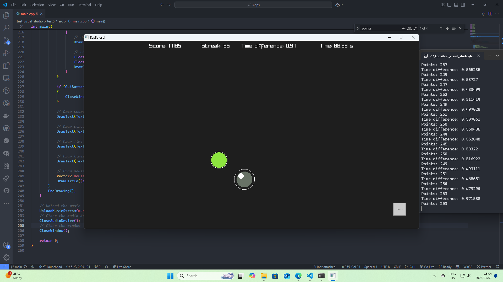

# Raylib-osu

A simple osu! clone made with raylib.

```
Download any song to the current directory and name it "input.mp3".
A beatmap will be generated automatically synced to the beat of the song.
There is a sample input.mp3 provided.
```

## Linux

### Prerequisites

```bash
sudo apt install wget
sudo apt install curl
sudo apt install cmake
sudo apt install ffmpeg
sudo apt install aubio-tools libaubio-dev libaubio-doc
```

### How to run

```bash
git clone https://github.com/JanDalhuysen/raylib-osu.git
cd raylib-osu
cmake .
make
./raylib-osu
```

## Windows

### Prerequisites

```bash
winget install -e --id JernejSimoncic.Wget
winget install -e --id cURL.cURL
winget install -e --id Gyan.FFmpeg
winget install -e --id Kitware.CMake
```

### How to run

```bash
git clone https://github.com/JanDalhuysen/raylib-osu.git
cd raylib-osu
cmake . -G "MinGW Makefiles"
mingw32-make
raylib-osu.exe
```


